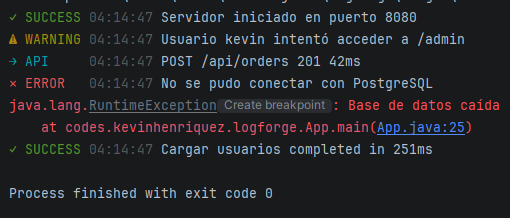

# LogForge


**LogForge** is a modern Java logging toolkit focused on developer experience, readable console output and intelligent runtime error explanations.

It provides beautiful terminal logs, ANSI colors, placeholder formatting, API request logs, exception tracing, source code frames, smart Java error hints and execution timers without heavy dependencies.

## Features

- Smart Java error explanations
- Source code frames for runtime exceptions
- AI-style fix suggestions for common exceptions
- Clean and readable console logs
- ANSI colored output
- Placeholder support using `{}`
- API request logging helper
- Exception logging with stack traces
- Execution timer utility
- Lightweight Java library
- Simple static API
- Configurable logger settings
- Log level filtering
- Console table support

## Preview



```txt
✓ SUCCESS 03:40:23 Server started on port 8080
⚠ WARNING 03:40:23 User kevin tried to access /admin
→ API     03:40:23 POST /api/orders 201 42ms
✕ ERROR   03:40:23 Failed to connect to PostgreSQL
java.lang.RuntimeException: Database unavailable
```

## Installation

Install LogForge from Maven Central:

```xml
<dependency>
    <groupId>io.github.devkevingg</groupId>
    <artifactId>logforge</artifactId>
    <version>0.1.0</version>
</dependency>
```

Or install it locally:

```bash
git clone https://github.com/DevKevingg/LogForge.git
cd LogForge
mvn clean install
```

## Usage

```java
import codes.kevinhenriquez.logforge.LogForge;

public class App {

    public static void main(String[] args) {

        LogForge.success("Server started on port {}", 8080);

        LogForge.warning(
                "User {} tried to access {}",
                "kevin",
                "/admin"
        );

        LogForge.api(
                "POST",
                "/api/orders",
                201,
                42
        );

        try {
            throw new RuntimeException("Database unavailable");
        } catch (Exception exception) {
            LogForge.error(
                    "Failed to connect to {}",
                    exception,
                    "PostgreSQL"
            );
        }

        LogForge.time("Load users", () -> {
            Thread.sleep(250);
        });
    }
}
```

## Error Hints

LogForge can analyze common Java exceptions and provide human-readable explanations, source code frames and smart fix suggestions based on the failing line.

```java
try {
    String value = null;
    value.toLowerCase();
} catch (Exception exception) {
    LogForge.explain(exception);
}
```

```txt
✕ ERROR   18:20:31 NullPointerException
Location: App.java:8

Code:
7 |     String value = null;
8 |     value.toLowerCase();
  | ^ failing line
9 | }

Why:
A value is null and Java cannot call methods or access fields on it.

Suggestion:
Check the object before using it, initialize it, or validate the input before calling methods.

Possible fix:
if (value != null) {
    value.toLowerCase();
}
```

## Configuration

```java
import codes.kevinhenriquez.logforge.config.LogForgeConfig;
import codes.kevinhenriquez.logforge.enums.LogLevelEnum;

LogForgeConfig.setColorsEnabled(false);

LogForgeConfig.setIconsEnabled(false);

LogForgeConfig.setTimestampEnabled(false);

LogForgeConfig.setMinimumLevel(LogLevelEnum.WARNING);

LogForgeConfig.setEnabled(false);

LogForgeConfig.reset();
```

## Table Support

```java
LogForge.table(
        new String[]{"ID", "User", "Role"},
        new String[][]{
        {"1", "Kevin", "Admin"},
        {"2", "Alex", "User"}
        }
        );
```

```txt
┌────┬────────┬───────┐
│ ID │ User   │ Role  │
├────┼────────┼───────┤
│ 1  │ Kevin  │ Admin │
│ 2  │ Alex   │ User  │
└────┴────────┴───────┘
```

## Available Methods

```java
LogForge.info("Application started");

LogForge.success("Server started on port {}", 8080);

LogForge.warning("User {} tried to access {}", "kevin", "/admin");

LogForge.debug("Debug mode enabled");

LogForge.api("GET", "/api/users", 200, 18);

LogForge.error("Failed to connect");

LogForge.error("Failed to connect to {}", exception, "PostgreSQL");

LogForge.explain(exception);

LogForge.time("Load users", () -> {
        Thread.sleep(250);
});

        LogForge.table(
        new String[]{"ID", "User"},
        new String[][]{
        {"1", "Kevin"}
        }
        );
```

## Requirements

- Java 17+
- Maven 3.8+

## Project Status

LogForge is currently in early development.

Current version:

```txt
0.1.0-SNAPSHOT
```

## Roadmap

- Configurable themes
- JSON log output
- File writer support
- Spring Boot starter
- Request logging filter for Spring Boot apps
- Custom timestamp format
- Async logging support
- File rotation support
- Advanced table styling
- More unit tests

## Contributing

Contributions are welcome.

You can help by:

- Reporting bugs
- Suggesting new features
- Improving documentation
- Adding tests
- Creating examples

## License

MIT License
